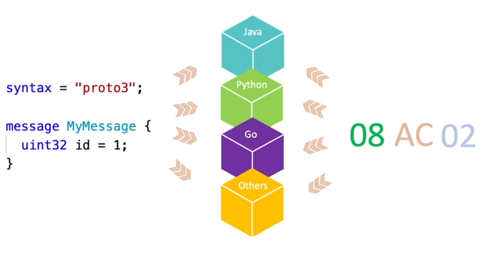
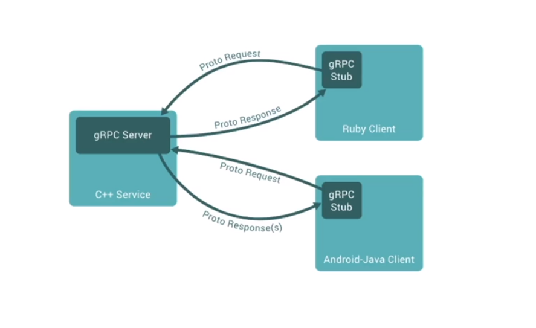

# Why Protocol Buffers ?

Protocol buffers is new way to transmite/share data between systems, having the follow advantages

- `Typed` - every attribute has a type avoiding schema infering or mistakes
- `Generate code` - through the proto compile it is possible to generate source code for several languages
- `Schema evolution` - allows message evolution and ensure backwards compatibility
- `Comments` - Allow to comment fields and explain how it is utilized
- `Binary` - It has a small size compared with JSON and XML since data is transmitted in binary format. This is also a disavantage since is hard to troubleshoot  

```proto
syntax = "proto3";

message SearchRequest {
  string query = 1;
  int32 page_number = 2;
  int32 results_per_page = 3;
}
```

> Protobuffers are 34% smaller than Json data objects, and takes 21% less time to be available

## Sharing Data with Protocol Buffer
---

Protocol Buffer could be used in order to generate code for several languages, handle the code to encode the data to binary format and decode it the original format.



## Protocol Buffer Integration

GRPC protocol is used to allow integration between services in agnostic way, besides the programming languege chosen


