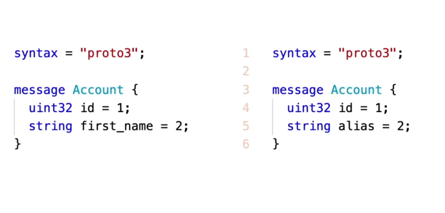
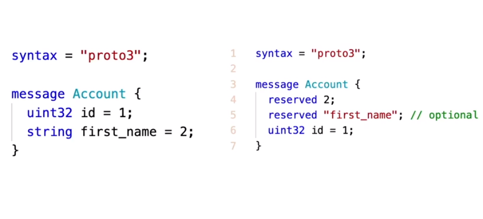

# Data Evolution

Protobuf was designed to support data evolution for example suppose the following schema

```proto
// Proto v1
syntax = "proto3"

message Account {
  string first_name = 1;
  string last_name = 2;
}
```

And after some type a new feature is required, resulting in add a new field called phone

```proto
// Proto v2
syntax = "proto3"

message Account {
  string first_name = 1;
  string last_name = 2;
  string phone = 3;
}
```


Protobuf can handle these situations when deserealizing.

- `Backward Compatible` (Server more advanced than Client) - If data was serialized using Proto v1 e deserialized using Proto v2, the field phone will assume its default value, i.e. an empty string

- `Forward Compatible` (Client more advanced than Server) - If data was serialized using Proto v2 e deserialized using Proto v2, just the information in protov1 will be populated

> Keep in mind that the Client is always who writes (serialize) the data

## Rules to Preserve Compatibility
---

- `Do not change Tags`
- `Add new fields` - the old code just will ignore them
- `Use reserved Tags` - If a field needs to be deleted, use reserved tags (Makes the field tag no usable anymore)
- `Before changing Type check the docs` - In order to ensure compatibility, prefer to add a new field

## Renaming Fields
---

Renaming is a trivial task, since the name just import to the code and not for the serialization process. So you just need to change the name in proto definition and update the code references. This is possible because the process of serialization and deserialization relies on tag field



## Removing Fields
---

Removing a Fields could generate a problem if the same tag field be used in the feature, so that's why it is a good idea to `reserved` the tag field to avoid (de)serialization problems in the future, and also reserve the field name in order to not mess up the code reference (this is optional)




```proto

syntax = "proto3"

// You can not reserve the tag fields and the name fields in the same line
message Account {
  // reserves the tag fields: 2, 9, 10, 11 e 15
  reserved 2, 15, 9 to 11;
  // reserves the tag name: "first_name" and "last_name"
  reserved "first_name", "last_name";
  uint32 id = 1;
}
```