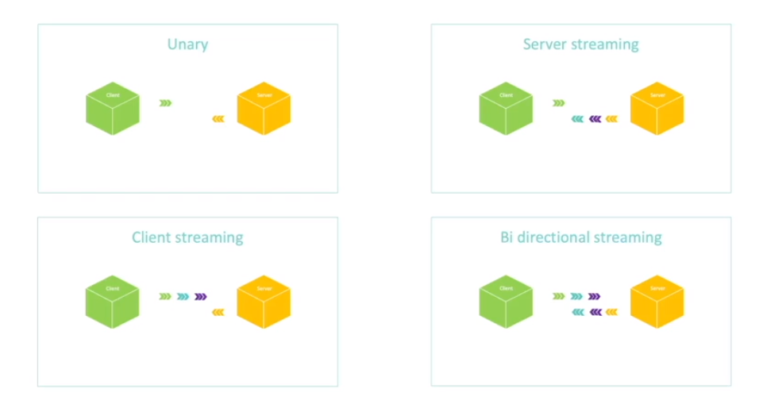

# gRPC


[gRPC](https://grpc.io/) is a modern open source high performance Remote Procedure Call (RPC) framework that can run in any environment. It can efficiently connect services in and across data centers with pluggable support for load balancing, tracing, health checking and authentication.

## HTTP/2
---

To really understand gRPC first it is necessary to understand the HTTP/2, which is a new version of HTTP/1 protocol intended to speed up the load time of pages, and request.

Whereas the HTTP/1 opens one connection per request, works with Plaintext headers and just handles the Request/Response patterns the HTTP/2 offers:

- `Multiplexing` - HTTP/2 uses a single TCP connection to send multiple streams of data at once
- `Header compression` - Uses the method `HPACK` removing redundant information in HTTP header packets
- `Server Push` - Server can push content without the client asks for it
- `Binary` - Data is much smallers and less computer intensive since bytes is used 

## Types of APIs in gRPC
---

Currently, there are four types of gRPC Apis

- `Unary` - Closest to Rest API, the client will send one request and the server will return one response

- `Server Streaming` - The client send one request and the server returns one or more responses (multiple responses). Ex. `Video Streaming, Realtime data`

- `Client Streaming` - The client send multiple requests and the server returns one response. Ex. `Upload`

- `Bidirectional Streaming` - The client send multiple requests and the server returns multiple requests



### Code Example

Watch close the keyword `stream`

```proto
service HelloService {
  
  // Unary
  rpc SayHello(HelloRequest) returns (HelloResponse);


  // Server Streaming
  rpc HelloManyTimes(HelloRequest) return (stream HelloResponse);

  // Client Streaming
  rpc LongHello(stream HelloRequest) return (HelloResponse);

  // Bidirectional streaming
  rpc HelloEveryone(stream HelloRequest) return (stream HelloResponse)
}
```